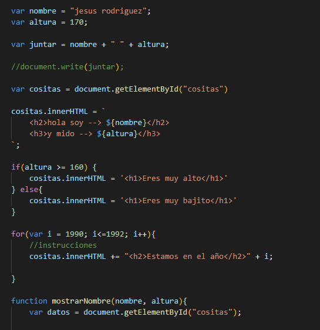
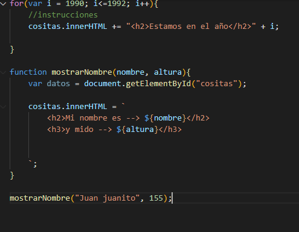
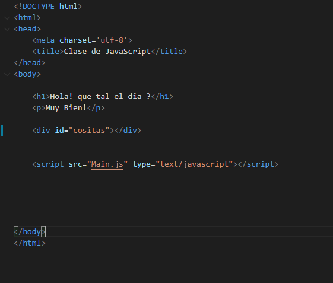

--------ANALISIS--------

OBJETO: entidad existente en la memoria del ordenador que tiene unas propiedades (atributos o datos sobre sí mismo almacenados por el objeto) y unas operaciones disponibles específicas (métodos).

CLASES: Las clases son la base de la Programación Orientada a Objetos. Una clase es una plantilla que define la forma de un objeto; en ella se agrupan datos y métodos que operarán sobre esos datos.

INSTANCIAS: una referencia de una clase hacia otra con lo cual permite a ambas clases ínteractuar entre si

HTML: HTML, siglas en inglés de HyperText Markup Language (‘lenguaje de marcado de hipertexto’), hace referencia al lenguaje de marcado para la elaboración de páginas web. Es un estándar que sirve de referencia del software que conecta con la elaboración de páginas web en sus diferentes versiones, define una estructura básica y un código (denominado código HTML) para la definición de contenido de una página web, como texto, imágenes, videos, juegos, entre otros.

JAVASCRIPT: JavaScript es un lenguaje de programación interpretado, dialecto del estándar ECMAScript. Se define como orientado a objetos, ​ basado en prototipos, imperativo, débilmente tipado y dinámico.
------Prueba------

