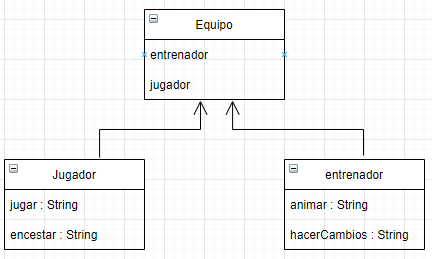
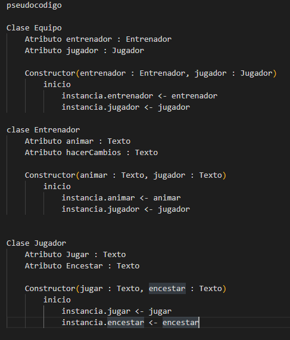
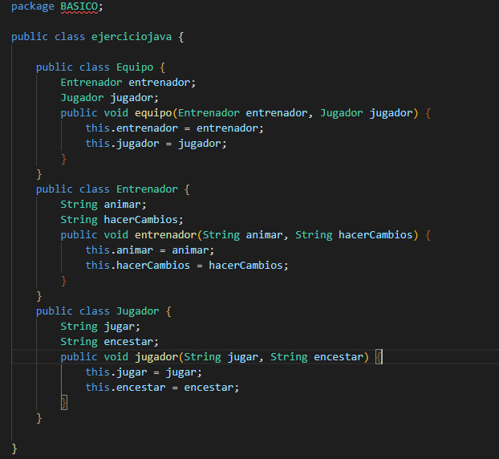
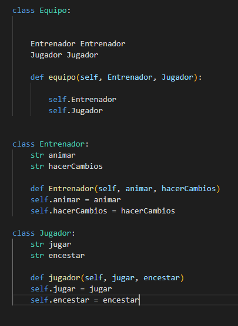

--------ANALISIS--------

OBJETO: entidad existente en la memoria del ordenador que tiene unas propiedades (atributos o datos sobre sí mismo almacenados por el objeto) y unas operaciones disponibles específicas (métodos).

CLASES: Las clases son la base de la Programación Orientada a Objetos. Una clase es una plantilla que define la forma de un objeto; en ella se agrupan datos y métodos que operarán sobre esos datos.

INSTANCIAS: una referencia de una clase hacia otra con lo cual permite a ambas clases ínteractuar entre si

JAVA: Java es un lenguaje de programación y una plataforma informática que fue comercializada por primera vez en 1995 por Sun Microsystems. Hay muchas aplicaciones y sitios web que no funcionarán, probablemente, a menos que tengan Java instalado y cada día se crean más.

PYTHON: Python es un lenguaje de programación interpretado cuya filosofía hace hincapié en la legibilidad de su código. Se trata de un lenguaje de programación multiparadigma, ya que soporta parcialmente la orientación a objetos, programación imperativa y, en menor medida, programación funcional.

PSEUDOCODIGO: Es una forma de escribir los pasos que va a realizar un programa de la forma mas cercana al lenguaje de programacion que vamos a utilizar posterioremente.

------DISEÑO-------

------Prueba------

