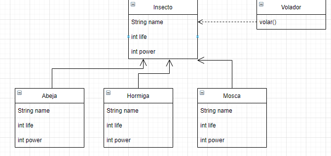
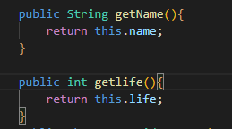
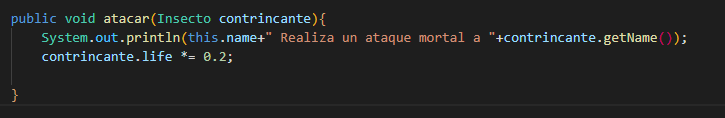
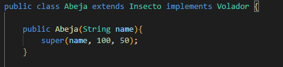
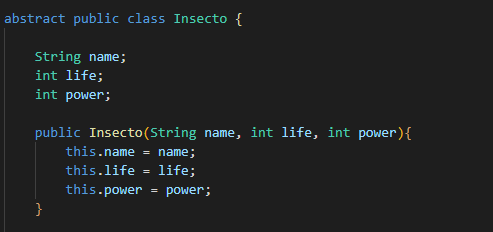
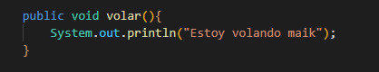
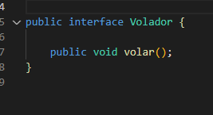

--------ANALISIS--------

Encapsulamiento : Consiste en ocultar atributos de un objeto de manera que solo se pueda cambiar mediante operaciones definidas en ese objeto. Está estrechamente relacionado con la visibilidad.

Abstracción : Consiste en seleccionar datos de un conjunto más grande para mostrar solo los detalles relevantes del objeto. Ayuda a reducir la complejidad y el esfuerzo de programación. En Java, la abstracción se logra usando clases e interfaces abstractas. Es uno de los conceptos más importantes de OOPs.

Herencia : Es un mecanismo que permite la definición de una clase a partir de la definición de otra ya existente. La herencia permite compartir automáticamente métodos y datos entre clases, subclases y objetos. ... Java sólo permite herencia simple.

Polimorfismo : Es la capacidad que tienen los objetos de una clase en ofrecer respuesta distinta e independiente en función de los parámetros (diferentes implementaciones) utilizados durante su invocación.

------DISEÑO-------

------Prueba------

